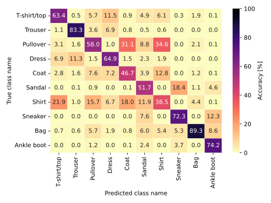
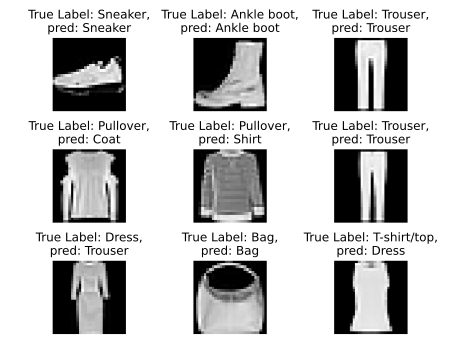

# Implementation of a neural network from scratch
A very simple and working implementation of a neural network from scratch.
For this implementation, only numpy is used. For preprocessing the data, sklearn is used. For implementation details, please refer to the [https://github.com/schlafel/Mathematical-Methods-For-MachineLearning/blob/main/Implementation_NeuralNetwork_FromScratch_.ipynb][Jupyter Notebook]


# Implementation details
The implementation consists of two classes:
* The class *DenseLayer*
* The class *NN*

Each *DenseLayer* corresponds to a densely connected layer with n-neurons and an activation 
function of choice. 
Currently, 4 different activation functions are implemented:

* Sigmoid
* tanh
* linear (No activation)
* ReLu

Currently, only classification tasks are supported as the loss function is hard programmed to binary-crossentropy.


## Useage

### Construct Model
The following code illustrates the creation of a simple Neural network with 2 hidden layers with 200 Neurons each and 1 output layer with 10 classes for classification.

```
#Initialize the model (Input size is used to initialize weights of the layers)
myNetwork = NN(input_size = (28,28),
                 learning_rate = 1e-4)
                 
#Define the layers of the model
Layer1 = DenseLayer(n_neurons=200)
Layer2 = DenseLayer(n_neurons=200)
Layer3 = DenseLayer(n_neurons=10,activation="sigmoid")

#Add the layers to the model (simple stacking)
myNetwork.add_layer(Layer1)
myNetwork.add_layer(Layer2)
myNetwork.add_layer(Layer3)
myNetwork.compile_model()
```


### Training
The model can then be trained as follows. 
* The training data (```X_train``` must have the shape of () and works for numpy arrays/pandas DataFrames)
* The training labels (```Y_train``` must have the shape of ())

```
myNetwork.fit(X_train=data_train,
                  Y_train = Y_train,
                  X_test = data_test,
                  Y_test = Y_test,
                  plot_res=True,
              n_epochs = 300
             )
myNetwork.save("myNetwork_300")
```
### Evaluation
New Predictions can be made using the ```predict()```-method from the ```NN```-clas. 

# Results for Fashion-Mnist
For the Fashion-Mnist-Dataset (https://github.com/zalandoresearch/fashion-mnist), training the network with the configuration from the above 
chapter resulted in an overall accuracy of ~60%. 

## Confusion matrix
Training results are shown below



## Sample predictions
Some predictions for 9 elements from the test-data 
are shown in the plot below:




